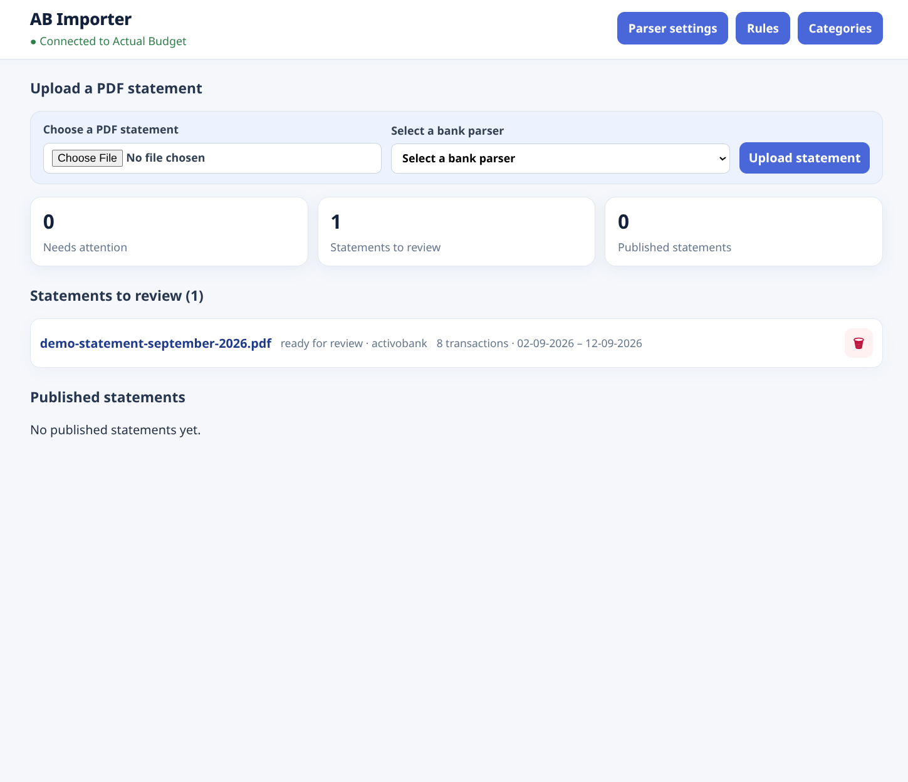
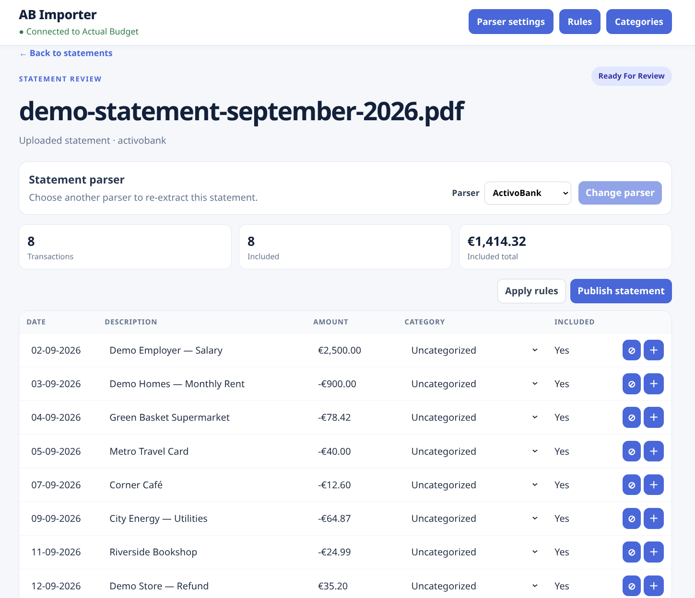
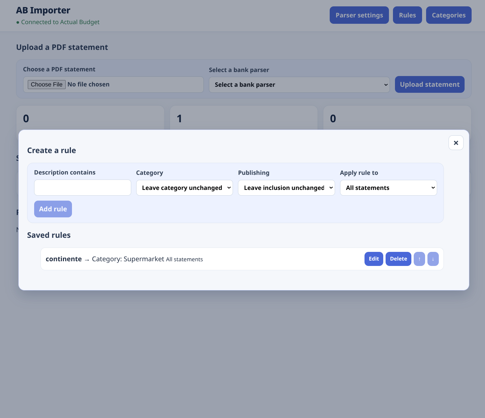
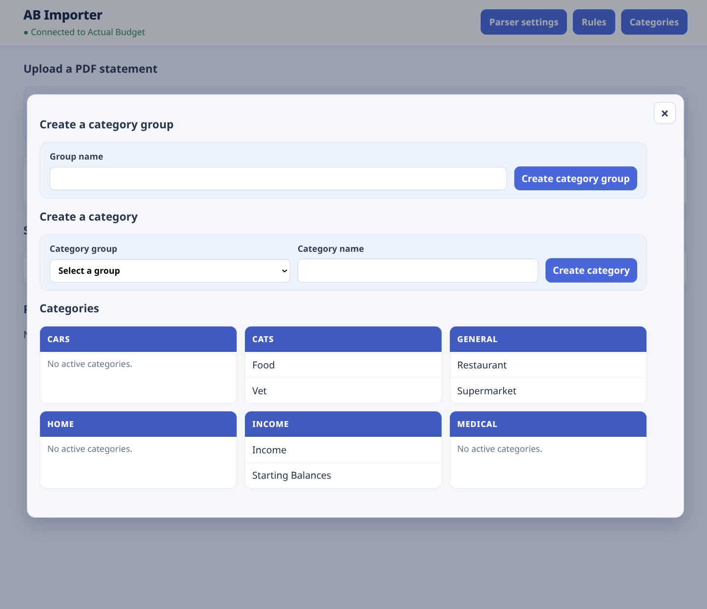

# Actual Budget Importer

Actual Budget Importer turns ActivoBank and WiZink PDF statements into
reviewable transactions before you publish them to Actual Budget. Statements
can be uploaded directly or received from Paperless-ngx. Categories are loaded
from Actual Budget, and new category groups and categories can be created from
the importer.

> [!IMPORTANT]
> This app is designed for one user on a trusted internal network. Do not
> expose it directly to the public internet

## Screenshots

<table>
  <tr>
    <td><a href="docs/screenshots/home.png"></a><br><strong>Dashboard</strong></td>
    <td><a href="docs/screenshots/statement.png"></a><br><strong>Statement review</strong></td>
    <td><a href="docs/screenshots/rules.png"></a><br><strong>Categorization rules</strong></td>
    <td><a href="docs/screenshots/group.png"></a><br><strong>Categories</strong></td>
  </tr>
</table>

## Quick start

Install Docker Compose, edit the placeholders in `docker-compose.yaml`, then
run:

```sh
docker compose up --build
```

Open `http://localhost:3000`. The local `./data` directory keeps the SQLite
database between runs. Run only one app instance against that database.

## `docker-compose.yaml`

```yaml
name: actual-budget-importer

services:
  actual-budget-importer:
    build: .
    image: actual-budget-importer:latest
    container_name: actual-budget-importer
    init: true
    restart: unless-stopped
    environment:
      ACTUAL_SERVER_URL: https://actual.example.test # Required Actual Budget server URL.
      ACTUAL_PASSWORD: change-me # Required Actual Budget server password.
      ACTUAL_BUDGET_ID: replace-with-budget-sync-id # Required budget sync ID.
      ACTUAL_ACCOUNT_ID: replace-with-destination-account-id # Required destination account ID.
      ACTUAL_ENCRYPTION_PASSWORD: "" # (Optional) Budget encryption password.

      APP_PORT: "3000" # (Optional) Application HTTP port.
      MAX_PDF_SIZE_BYTES: "104857600" # (Optional) Maximum PDF size; defaults to 100 MiB.
      EXTRACTION_TIMEOUT_MS: "300000" # (Optional) Extraction timeout; defaults to five minutes.

      PAPERLESS_URL: "" # (Optional) Paperless-ngx URL; set with PAPERLESS_API_TOKEN.
      PAPERLESS_API_TOKEN: "" # (Optional) Paperless-ngx token; set with PAPERLESS_URL.
    ports:
      - "3000:3000"
    volumes:
      - ./data:/data
```

Paperless-ngx is optional. To enable it, set both `PAPERLESS_URL` and
`PAPERLESS_API_TOKEN`. PDF processing defaults to a 100 MiB limit and a
five-minute timeout; both can be changed in the Compose file.

## Development

Local development requires Node.js 22+ and pnpm:

```sh
pnpm install --frozen-lockfile
pnpm run typecheck
pnpm test
pnpm start:server
```

The API runs on port 3000 and the Vite interface on port 5173.

## License

Licensed under the [GNU General Public License, version 3 or later](LICENSE).
